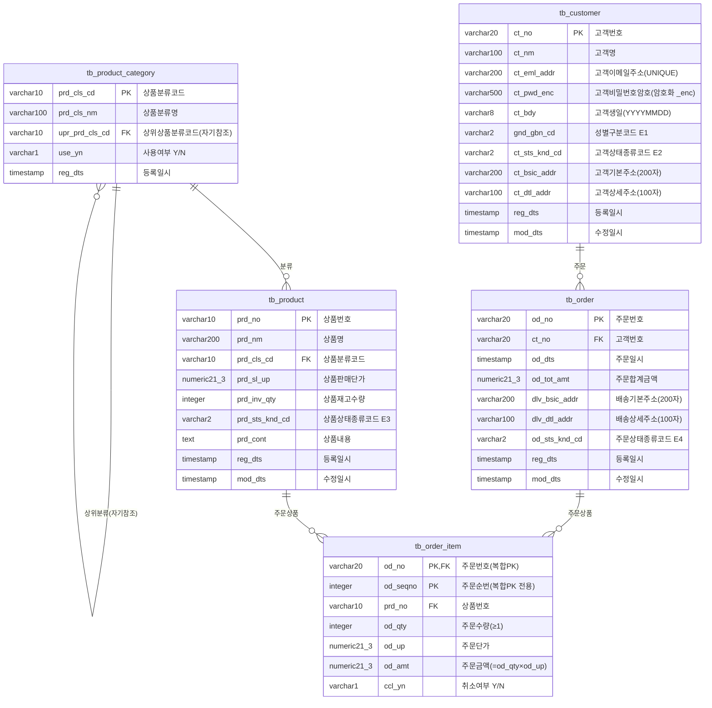

# 쇼핑몰 ERD — 표준 근거 문서

> 작성일: 2026-05-30  
> 최종수정: 2026-05-30 (샘플 데이터·제약 요약·인덱스 보강)  
> 근거: 표준단어·도메인·코드 지침서, 명명규칙 3종, SQLiteDB_for_META_v5.db

---

## 1. Mermaid ERD



---

## 2. 테이블별 컬럼 표준 근거

### tb_product_category (상품분류, CPRC)

| 컬럼명 | 타입 | 표준단어 조합 | 도메인 | 비고 |
|--------|------|-------------|--------|------|
| `prd_cls_cd` | varchar(10) | PRD+CLS+CD | 상품분류코드도메인 | PK, 개별코드 |
| `prd_cls_nm` | varchar(100) | PRD+CLS+NM | 고객명도메인(명칭류 100자) | — |
| `upr_prd_cls_cd` | varchar(10) | UPR+PRD+CLS+CD | 상품분류코드도메인 | FK 자기참조, NULL=최상위 |
| `use_yn` | varchar(1) | USE+YN | 코드2자리도메인 | CHECK IN('Y','N') #3 |
| `reg_dts` | timestamp | REG+DTS | 일시도메인 | DEFAULT CURRENT_TIMESTAMP #8 |

### tb_product (상품, CPRI)

| 컬럼명 | 타입 | 표준단어 조합 | 도메인 | 비고 |
|--------|------|-------------|--------|------|
| `prd_no` | varchar(10) | PRD+NO | 상품번호도메인 | PK |
| `prd_nm` | varchar(200) | PRD+NM | — | NOT NULL |
| `prd_cls_cd` | varchar(10) | PRD+CLS+CD | 상품분류코드도메인 | FK → tb_product_category |
| `prd_sl_up` | numeric(21,3) | PRD+SL+UP | 단가도메인 | CHECK ≥0, 지침서 §4.2 #2 |
| `prd_inv_qty` | integer | PRD+INV+QTY | 수량도메인 | CHECK ≥0 |
| `prd_sts_knd_cd` | varchar(2) | PRD+STS+KND+CD | 코드2자리도메인 | E3000001 #4 |
| `reg_dts` / `mod_dts` | timestamp | REG+DTS / MOD+DTS | 일시도메인 | #8 |

### tb_customer (고객, CCSI)

| 컬럼명 | 타입 | 표준단어 조합 | 도메인 | 비고 |
|--------|------|-------------|--------|------|
| `ct_no` | varchar(20) | CT+NO | 고객번호도메인 | PK |
| `ct_nm` | varchar(100) | CT+NM | 고객명도메인 | NOT NULL |
| `ct_eml_addr` | varchar(200) | CT+EML+ADDR | 기본주소도메인 | UNIQUE |
| `ct_pwd_enc` | varchar(500) | CT+PWD+ENC | 암호도메인 | 암호화 접미어 _enc #9 |
| `ct_bdy` | varchar(8) | CT+BDY | 생일도메인 | YYYYMMDD 형식 |
| `gnd_gbn_cd` | varchar(2) | GND+GBN+CD | 코드2자리도메인 | E1000001, NULL 허용 #4 |
| `ct_sts_knd_cd` | varchar(2) | CT+STS+KND+CD | 코드2자리도메인 | E2000001 #4 |
| `ct_bsic_addr` | varchar(200) | CT+BSIC+ADDR | 기본주소도메인 | 200자 #7 |
| `ct_dtl_addr` | varchar(100) | CT+DTL+ADDR | 상세주소도메인 | 100자 #7 |

### tb_order (주문, CODI)

| 컬럼명 | 타입 | 표준단어 조합 | 도메인 | 비고 |
|--------|------|-------------|--------|------|
| `od_no` | varchar(20) | OD+NO | 주문번호도메인 | PK |
| `ct_no` | varchar(20) | CT+NO | 고객번호도메인 | FK → tb_customer |
| `od_dts` | timestamp | OD+DTS | 일시도메인 | DEFAULT CURRENT_TIMESTAMP #8 |
| `od_tot_amt` | numeric(21,3) | OD+TOT+AMT | 처리금액도메인 | CHECK ≥0 #2 |
| `dlv_bsic_addr` | varchar(200) | DLV+BSIC+ADDR | 기본주소도메인 | 200자 #7 |
| `dlv_dtl_addr` | varchar(100) | DLV+DTL+ADDR | 상세주소도메인 | 100자 #7 |
| `od_sts_knd_cd` | varchar(2) | OD+STS+KND+CD | 코드2자리도메인 | E4000001 #4 |

### tb_order_item (주문상품, CODD)

| 컬럼명 | 타입 | 표준단어 조합 | 도메인 | 비고 |
|--------|------|-------------|--------|------|
| `od_no` | varchar(20) | OD+NO | 주문번호도메인 | 복합PK + FK → tb_order |
| `od_seqno` | integer | OD+SEQNO | 순번도메인 | 복합PK 전용 #6 |
| `prd_no` | varchar(10) | PRD+NO | 상품번호도메인 | FK → tb_product |
| `od_qty` | integer | OD+QTY | 수량도메인 | CHECK ≥1 |
| `od_up` | numeric(21,3) | OD+UP | 단가도메인 | CHECK ≥0 #2 |
| `od_amt` | numeric(21,3) | OD+AMT | 처리금액도메인 | CHECK ≥0, = od_qty × od_up #2 |
| `ccl_yn` | varchar(1) | CCL+YN | 코드2자리도메인 | CHECK IN('Y','N') #3 |

---

## 3. 표준코드 참조

| 코드그룹ID | 그룹명 | 코드값 | 코드명 | 사용 컬럼 |
|-----------|--------|--------|--------|---------|
| E1000001 | 성별구분코드 | 01 | 남성 | `gnd_gbn_cd` |
| E1000001 | 성별구분코드 | 02 | 여성 | `gnd_gbn_cd` |
| E1000001 | 성별구분코드 | 09 | 기타 | `gnd_gbn_cd` |
| E2000001 | 고객상태종류코드 | 01 | 정상 | `ct_sts_knd_cd` |
| E2000001 | 고객상태종류코드 | 02 | 휴면 | `ct_sts_knd_cd` |
| E2000001 | 고객상태종류코드 | 03 | 탈퇴 | `ct_sts_knd_cd` |
| E3000001 | 상품상태종류코드 | 01 | 판매중 | `prd_sts_knd_cd` |
| E3000001 | 상품상태종류코드 | 02 | 품절 | `prd_sts_knd_cd` |
| E3000001 | 상품상태종류코드 | 03 | 판매중지 | `prd_sts_knd_cd` |
| E4000001 | 주문상태종류코드 | 01 | 주문접수 | `od_sts_knd_cd` |
| E4000001 | 주문상태종류코드 | 02 | 결제완료 | `od_sts_knd_cd` |
| E4000001 | 주문상태종류코드 | 03 | 배송준비 | `od_sts_knd_cd` |
| E4000001 | 주문상태종류코드 | 04 | 배송중 | `od_sts_knd_cd` |
| E4000001 | 주문상태종류코드 | 05 | 배송완료 | `od_sts_knd_cd` |
| E4000001 | 주문상태종류코드 | 06 | 취소 | `od_sts_knd_cd` |
| E4000001 | 주문상태종류코드 | 07 | 반품 | `od_sts_knd_cd` |

---

## 4. 제약조건 요약

| 테이블 | 제약명 | 종류 | 내용 |
|--------|--------|------|------|
| tb_product_category | pk_product_category | PK | prd_cls_cd |
| tb_product_category | fk_product_category_self | FK | upr_prd_cls_cd → prd_cls_cd (자기참조) |
| tb_product_category | ck_product_category_use_yn | CHECK | use_yn IN ('Y','N') |
| tb_product | pk_product | PK | prd_no |
| tb_product | fk_product_category | FK | prd_cls_cd → tb_product_category |
| tb_product | ck_product_sl_up | CHECK | prd_sl_up ≥ 0 |
| tb_product | ck_product_inv_qty | CHECK | prd_inv_qty ≥ 0 |
| tb_product | ck_product_sts_knd_cd | CHECK | prd_sts_knd_cd IN ('01','02','03') |
| tb_customer | pk_customer | PK | ct_no |
| tb_customer | uq_customer_eml | UNIQUE | ct_eml_addr |
| tb_customer | ck_customer_gnd_gbn_cd | CHECK | NULL 또는 IN ('01','02','09') |
| tb_customer | ck_customer_sts_knd_cd | CHECK | ct_sts_knd_cd IN ('01','02','03') |
| tb_order | pk_order | PK | od_no |
| tb_order | fk_order_customer | FK | ct_no → tb_customer |
| tb_order | ck_order_tot_amt | CHECK | od_tot_amt ≥ 0 |
| tb_order | ck_order_sts_knd_cd | CHECK | od_sts_knd_cd IN ('01'~'07') |
| tb_order_item | pk_order_item | PK | (od_no, od_seqno) 복합 |
| tb_order_item | fk_order_item_order | FK | od_no → tb_order |
| tb_order_item | fk_order_item_product | FK | prd_no → tb_product |
| tb_order_item | ck_order_item_qty | CHECK | od_qty ≥ 1 |
| tb_order_item | ck_order_item_up | CHECK | od_up ≥ 0 |
| tb_order_item | ck_order_item_amt | CHECK | od_amt ≥ 0 |
| tb_order_item | ck_order_item_ccl_yn | CHECK | ccl_yn IN ('Y','N') |

---

## 5. 인덱스 목록

| 인덱스명 | 테이블 | 컬럼 | 용도 |
|---------|--------|------|------|
| idx_product_category_upr | tb_product_category | upr_prd_cls_cd | 계층 탐색 |
| idx_product_cls | tb_product | prd_cls_cd | 분류별 상품 조회 |
| idx_product_sts | tb_product | prd_sts_knd_cd | 상태별 필터링 |
| idx_order_ct | tb_order | ct_no | 고객별 주문 조회 |
| idx_order_sts | tb_order | od_sts_knd_cd | 상태별 주문 조회 |
| idx_order_dts | tb_order | od_dts DESC | 최신 주문 정렬 |
| idx_order_item_prd | tb_order_item | prd_no | 상품별 주문 집계 |

---

## 6. 시스템 컬럼 패턴

모든 테이블은 지침서 §8 (시스템 컬럼 규칙)에 따라 다음 패턴을 공유합니다.

| 컬럼명 | 타입 | 규칙 | 의미 |
|--------|------|------|------|
| `reg_dts` | timestamp | NOT NULL, DEFAULT CURRENT_TIMESTAMP | 레코드 최초 등록 일시 |
| `mod_dts` | timestamp | NULL 허용 | 마지막 수정 일시, 미수정 시 NULL |

> `tb_order_item`은 단가 이력을 고정 보존하는 특성상 `mod_dts`를 두지 않습니다 (주문 후 단가 변경 불허).

---

## 7. 샘플 데이터 예시

### tb_product_category (5건)

| prd_cls_cd | prd_cls_nm | upr_prd_cls_cd | use_yn |
|-----------|-----------|---------------|--------|
| CAT001 | 전자제품 | NULL | Y |
| CAT002 | 의류 | NULL | Y |
| CAT011 | 스마트폰 | CAT001 | Y |
| CAT012 | 노트북 | CAT001 | Y |
| CAT021 | 상의 | CAT002 | Y |

### tb_product (6건)

| prd_no | prd_nm | prd_cls_cd | prd_sl_up | prd_inv_qty | prd_sts_knd_cd |
|--------|--------|-----------|----------|------------|---------------|
| PRD000001 | 갤럭시 S25 | CAT011 | 1,200,000 | 50 | 01(판매중) |
| PRD000002 | 맥북 에어 M4 | CAT012 | 1,590,000 | 30 | 01(판매중) |
| PRD000003 | 아이폰 16 프로 | CAT011 | 1,550,000 | 0 | 02(품절) |
| PRD000004 | LG 그램 17 | CAT012 | 1,890,000 | 15 | 01(판매중) |
| PRD000005 | 면 라운드넥 티셔츠 | CAT021 | 29,000 | 200 | 01(판매중) |
| PRD000006 | 슬림핏 셔츠 | CAT021 | 0 | 0 | 03(판매중지) |

### tb_customer (3건)

| ct_no | ct_nm | ct_eml_addr | gnd_gbn_cd | ct_sts_knd_cd |
|-------|-------|------------|-----------|--------------|
| CT20260001 | 홍길동 | hong@example.com | 01(남성) | 01(정상) |
| CT20260002 | 김영희 | kim@example.com | 02(여성) | 01(정상) |
| CT20260003 | 이철수 | lee@example.com | 01(남성) | 02(휴면) |

### tb_order (4건)

| od_no | ct_no | od_tot_amt | od_sts_knd_cd | 비고 |
|-------|-------|-----------|--------------|------|
| OD20260530001 | CT20260001 | 2,458,000 | 02(결제완료) | 갤럭시×2 + 티셔츠×2 |
| OD20260530002 | CT20260002 | 1,590,000 | 05(배송완료) | 맥북×1 |
| OD20260530003 | CT20260001 | 1,550,000 | 06(취소) | 아이폰×1 취소 |
| OD20260530004 | CT20260002 | 3,090,000 | 04(배송중) | 갤럭시×1 + LG그램×1 |

### tb_order_item (6건)

| od_no | od_seqno | prd_no | od_qty | od_up | od_amt | ccl_yn |
|-------|---------|--------|--------|-------|--------|--------|
| OD20260530001 | 1 | PRD000001 | 2 | 1,200,000 | 2,400,000 | N |
| OD20260530001 | 2 | PRD000005 | 2 | 29,000 | 58,000 | N |
| OD20260530002 | 1 | PRD000002 | 1 | 1,590,000 | 1,590,000 | N |
| OD20260530003 | 1 | PRD000003 | 1 | 1,550,000 | 1,550,000 | Y(취소) |
| OD20260530004 | 1 | PRD000001 | 1 | 1,200,000 | 1,200,000 | N |
| OD20260530004 | 2 | PRD000004 | 1 | 1,890,000 | 1,890,000 | N |

> **합계 검증**: OD20260530001 = 2,400,000 + 58,000 = **2,458,000** ✅  
> OD20260530004 = 1,200,000 + 1,890,000 = **3,090,000** ✅

---

## 8. FK 의존성 순서 (배포 / 롤백 참조)

```
배포 순서 (생성)          롤백 순서 (삭제)
① tb_product_category    ⑤ tb_order_item
② tb_product             ④ tb_order
③ tb_customer            ③ tb_customer
④ tb_order               ② tb_product
⑤ tb_order_item          ① tb_product_category
```
